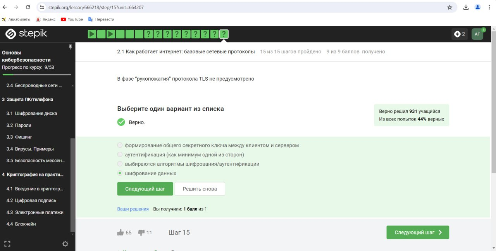
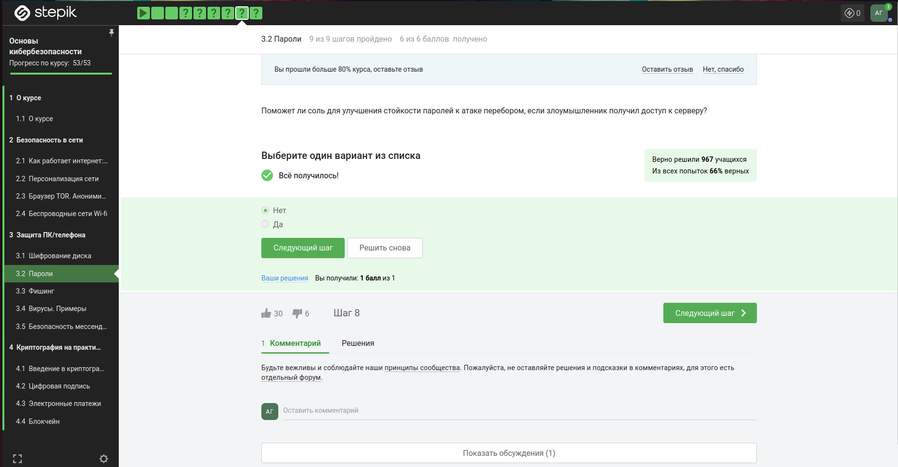
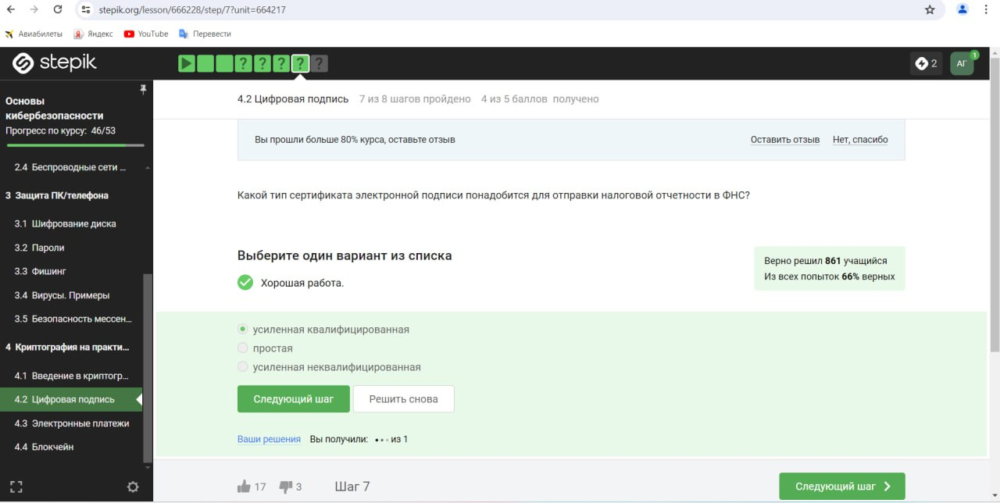
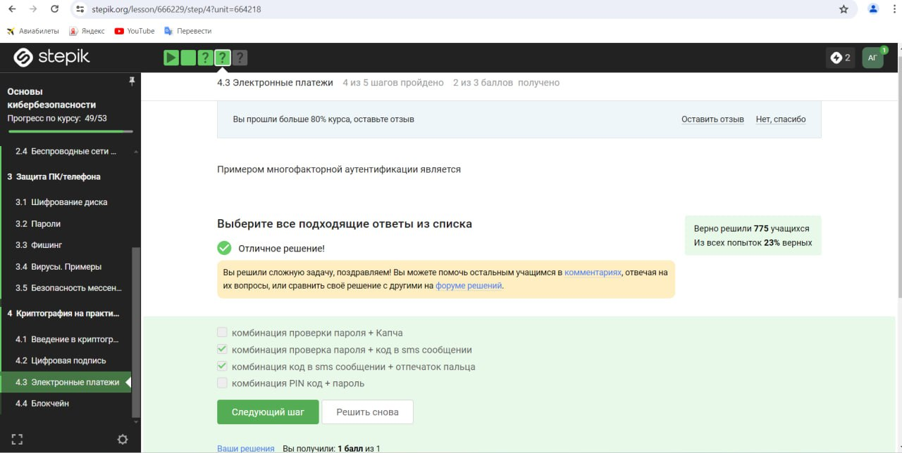

---
## Front matter
title: "Отчет по прохождению курса на Stepik"
subtitle: "Основы кибербезопасности"
author: "Гисматуллин Артём Вадимович НПИбд-01-22"

## Generic otions
lang: ru-RU
toc-title: "Содержание"

## Bibliography
bibliography: bib/cite.bib
csl: pandoc/csl/gost-r-7-0-5-2008-numeric.csl

## Pdf output format
toc: true # Table of contents
toc-depth: 2
lof: true # List of figures
lot: true # List of tables
fontsize: 12pt
linestretch: 1.5
papersize: a4
documentclass: scrreprt
## I18n polyglossia
polyglossia-lang:
  name: russian
  options:
	- spelling=modern
	- babelshorthands=true
polyglossia-otherlangs:
  name: english
## I18n babel
babel-lang: russian
babel-otherlangs: english
## Fonts
mainfont: PT Serif
romanfont: PT Serif
sansfont: PT Sans
monofont: PT Mono
mainfontoptions: Ligatures=TeX
romanfontoptions: Ligatures=TeX
sansfontoptions: Ligatures=TeX,Scale=MatchLowercase
monofontoptions: Scale=MatchLowercase,Scale=0.9
## Biblatex
biblatex: true
biblio-style: "gost-numeric"
biblatexoptions:
  - parentracker=true
  - backend=biber
  - hyperref=auto
  - language=auto
  - autolang=other*
  - citestyle=gost-numeric
## Pandoc-crossref LaTeX customization
figureTitle: "Рис."
tableTitle: "Таблица"
listingTitle: "Листинг"
lofTitle: "Список иллюстраций"
lotTitle: "Список таблиц"
lolTitle: "Листинги"
## Misc options
indent: true
header-includes:
  - \usepackage{indentfirst}
  - \usepackage{float} # keep figures where there are in the text
  - \floatplacement{figure}{H} # keep figures where there are in the text
---

# Цель работы

 - понять, как работает Интернет, и какие у него “слабые” места

 - уяснить, почему 1245YOURNAME -- плохой пароль

 - научиться отличать шифрование от электронной подписи

 - узнать, как работают электронные платежи

# Задание

Последовательно выполнять все пункты, занося ответы и замечания в отчет.

# Выполнение лабораторной работы
 
Прежде, чем приступить к подробному описанию прохождения каждого из тестовых заданий, следует обратить внимание на то, что за этот курс сертификат не выдается. Именно поэтому я не прикладываю его как доказательство того, что курс полностью пройден (рис. [-@fig:001])

{ #fig:001 width=70%, height=70% }

На этом скриншоте так же видно, что курс пройден на 100%

## Безопасность в сети

1. Как работает интернет.

Известно из теории, что протоколом прикладного уровня является HTTPS протокол (рис. [-@fig:002])

{ #fig:002 width=70%, height=70% }

Если говорить о протоколе TCP, то снова из теории мы знаем, что это транспортный уровень (рис. [-@fig:003])

{ #fig:003 width=70%, height=70% } 

Это задание удалось сделать благодаря осознанию тому, что в IPv4 адресе не может быть значения больше 255 (рис. [-@fig:004])

{ #fig:004 width=70%, height=70% } 

Из определения DNS сервера и теории мы находим здесь верный ответ (рис. [-@fig:005])

{ #fig:005 width=70%, height=70% } 

Так как последовательность протоколов из теории строится таким образом, то ответ соответсвует 4 строке (рис. [-@fig:006])

{ #fig:006 width=70%, height=70% } 

В зашиврованном виде передает данные протокол https (рис. [-@fig:007])

{ #fig:007 width=70%, height=70% } 

В следующем вопросе мы из теории понимаем, что из таких фаз состоит протокол https (рис. [-@fig:008])

{ #fig:008 width=70%, height=70% } 

Известно, что версия протокола TLS определяется в процессе общения сервером и клиентом (рис. [-@fig:009])

{ #fig:009 width=70%, height=70% }

И в этот момент не происходит шифорвания данных (рис. [-@fig:010])

{ #fig:010 width=70%, height=70% }  

2. Персонализация сети

Здесь мы знакомимся подробнее с куки файлами. Они содержат идентификатор пользователя и номер сессии (рис. [-@fig:011])

{ #fig:011 width=70%, height=70% } 

Куки совсем не используются для улучшения надежности соединения (рис. [-@fig:012])

{ #fig:012 width=70%, height=70% } 

Также они генерируются сервером, разумеется (рис. [-@fig:013])

{ #fig:013 width=70%, height=70% } 

И сессионные данные хранятся как раз в течение того времени, пока веб-браузер открыт(рис. [-@fig:014])

{ #fig:014 width=70%, height=70% } 

3. Браузер TOR.

Именно 3 узла в луковой сети необходимо для работы браузера, ведь меньше не дает достаточной анонимности, а больше - ее не увеличивает (рис. [-@fig:015])

{ #fig:015 width=70%, height=70% } 

Ip адрес должен быть известен, конечно, отправителю и выходному узлу, остальные эти данные не имеют (рис. [-@fig:016])

{ #fig:016 width=70%, height=70% } 

Общий секретный ключ генерируется с тремя узлами (рис. [-@fig:017])

{ #fig:017 width=70%, height=70% } 

И для успешного получения пакетов пользователь не обязан использовать этот браузер (рис. [-@fig:018])

{ #fig:018 width=70%, height=70% } 

4. Беспроводные сети Wi-fi.

Wi-fi - это технология беспроводной локальной сети, работающая в соответствии со стандартом IEEE 802.11. Остальные варианты совсем не подходят (рис. [-@fig:019])

{ #fig:019 width=70%, height=70% } 

Этот протокол работает, конечно, на канальном уровне (рис. [-@fig:020])

{ #fig:020 width=70%, height=70% } 

Устаревшим методом является WEP (рис. [-@fig:021])

{ #fig:021 width=70%, height=70% }

Данные передаются в зашифрованном виде после аутентификации (рис. [-@fig:022])

{ #fig:022 width=70%, height=70% } 

Для домашней сети, конечно, используем персональный метод (рис. [-@fig:023])

{ #fig:023 width=70%, height=70% } 

## Защита ПК/телефона

1. Шифрование диска

Из теории известно, что загрузочный сектор диска можно зашифровать (рис. [-@fig:024])

{ #fig:024 width=70%, height=70% } 

Шифрование же диска основнано на симметричном шифровании (рис. [-@fig:025])

{ #fig:025 width=70%, height=70% } 

О методах шифрования я узнал из теоретической части (рис. [-@fig:026])

{ #fig:026 width=70%, height=70% } 

2. Пароли

К стойким паролям можно отнести тот, где используются цифры, буквы большие/маленькие, символы (рис. [-@fig:027])

{ #fig:027 width=70%, height=70% } 

Конечно, безопасно хранить пароли в менеджерах паролей (рис. [-@fig:028])

{ #fig:028 width=70%, height=70% }

Капча же помогает нам защититься от несанкционированных атак и постоянных попыток проникновения (рис. [-@fig:029])

{ #fig:029 width=70%, height=70% }   

Хэширование же помогает не хранить пароли в открытом виде (рис. [-@fig:030])

{ #fig:030 width=70%, height=70% } 

Соль в этом случае не помогает, так как у злоумышленника есть доступ к серверу и рашифровке хэша (рис. [-@fig:031])

{ #fig:031 width=70%, height=70% } 

Все перечисленное помогает нам от злоумышленников (рис. [-@fig:032])

{ #fig:032 width=70%, height=70% } 

3. Фишинг

В этих ссылках мы можем усмотреть, что они очень похожи на настоящие, но есть всегда в них добавление лишних элеметнов через точку (рис. [-@fig:033])

{ #fig:033 width=70%, height=70% } 

И, конечно, от знакомого имейла может прийти фишинговый файл или ссылка (рис. [-@fig:034])

{ #fig:034 width=70%, height=70% }

4. Вирусы. Примеры

Из самого названия становится ясно, что это подмена отправителя (рис. [-@fig:035])

{ #fig:035 width=70%, height=70% }  

Вирус-троян всегда старается скрыться под видом невредоностной, известной программы (рис. [-@fig:036])

{ #fig:036 width=70%, height=70% } 

5. Безопасность мессенджеров

В протоколе мессенджеров Signal ключ генерируется при первом сообщении (рис. [-@fig:037])

{ #fig:037 width=70%, height=70% } 

Сообщения передаются по узлам связи (серверам) в зашифрованном виде - это является сутью сквозного шифрования (рис. [-@fig:038])

{ #fig:038 width=70%, height=70% }

## Криптография на практике

1. Введение

В ассиметричных криптографичческих примитивах обе стороны имеют пару ключей (рис. [-@fig:039])

{ #fig:039 width=70%, height=70% } 

Известно, что криптографическая хэш-функция лишь не обеспечивает конфиденциальность данных (рис. [-@fig:040])

{ #fig:040 width=70%, height=70% } 

Из теории мы можем увидеть, что относится к алгоритмам цифровой подписи (рис. [-@fig:041])

{ #fig:041 width=70%, height=70% } 

Код аутентификации, конечно, относится к симметричным приметивам (рис. [-@fig:042])

{ #fig:042 width=70%, height=70% } 

Здесь ответ можно найти из теоретической вкладки (рис. [-@fig:043])

{ #fig:043 width=70%, height=70% } 

2. Цифровая подпись

Протокол электронной цифровой подписи имеет открытый ключ (рис. [-@fig:044])

{ #fig:044 width=70%, height=70% }

Верификация же происходит посредством самой подписи, открытого ключа и сообщения (рис. [-@fig:045])

{ #fig:045 width=70%, height=70% } 

Электронная подпись, очевидно, не обеспечивает конфиденциальности (рис. [-@fig:046])

{ #fig:046 width=70%, height=70% } 

Для ФНС нам потребуется усиленный квалифицированный сертификат (рис. [-@fig:047])

{ #fig:047 width=70%, height=70% } 

Это мы можем сделать в сертификационном центре (рис. [-@fig:048])

{ #fig:048 width=70%, height=70% } 

3. Электронные платежи

Я тут выделил известные мне платежные системы (рис. [-@fig:049])

{ #fig:049 width=70%, height=70% } 

Это яркие примеры многофакторной (двуэтапной) аутентификации (рис. [-@fig:050])

{ #fig:050 width=70%, height=70% }

При онлайн платежах используется следующее: (рис. [-@fig:051])

{ #fig:051 width=70%, height=70% }  

4. Блокчейн

Сложность нахождения прообраза - основное свойство хэш-функции (рис. [-@fig:052])

{ #fig:052 width=70%, height=70% } 

Консунсус обладает всеми предложенными свойствами, они подробно освещены в теории (рис. [-@fig:053])

{ #fig:053 width=70%, height=70% } 

Участники блокчейна хранят цифровую подпись (рис. [-@fig:054])

{ #fig:054 width=70%, height=70% } 

# Выводы

В ходе выполнения данного курса были освоены навыки по защите ПК, введение в криптографию, а также мы узнали больше о безопасности в сети.

# Список литературы{.unnumbered}

1. [Курс Stepik](https://stepik.org/course/111512/syllabus)

